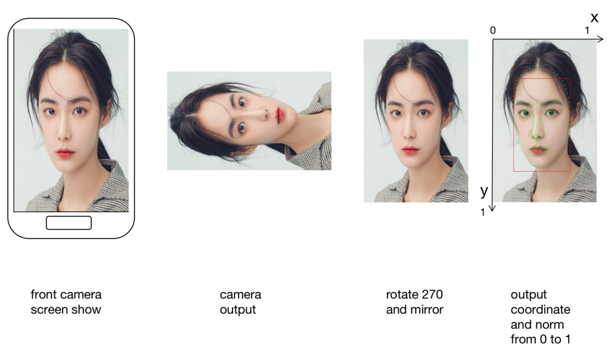

简体中文 | [English](../README.md)

# 介绍
Tengine Kit Android应用程序演示了如何在Android系统中使用和集成各种基于视觉的Tengine Kit功能。

# 配置Gradle
首先下载tengine-kit-sdk1.0.0.aar

在主Module中的```build.gradle``` 添加aar依赖
```groovy
    dependencies {
    ...
    implementation files('path/tengine-kit-sdk1.0.0.aar')
    ...
}
```           

# 系统
Android
- 系统最低要求API 21

# 使用
- [API](Android_api_CN.md) : 使用Tengine-Kit API来完成你所需要得功能。
- [使用示例](Usage.md) : 您可以伴随着您给我们的```star```一起看看使用示例，感谢。
- [老版本API](https://github.com/OAID/TengineKit/blob/test/Android/docs/Android_api_CN.md) : 使用TengineKitCore-v0.0.4或者更老版本API来完成你所需要得功能。
- [老版本使用示例](https://github.com/OAID/TengineKit/blob/test/Android/docs/Usage.md) : TengineKitCore-v0.0.4或者更老版本API使用示例。

# 权限
``` permission
<uses-permission android:name="android.permission.INTERNET"/>
<uses-permission android:name="android.permission.READ_EXTERNAL_STORAGE"/>
<uses-permission android:name="android.permission.WRITE_EXTERNAL_STORAGE"/>
<uses-permission android:name="android.permission.READ_PHONE_STATE"/>
```

# 示例
“source/”文件夹下的Android代码。
# 接入指南
在TengineKit Api的setRotation 里有两个有两个参数ori和is_screen_rotate，分别为旋转角度和是否跟随屏幕旋转。这个是否跟随屏幕在Manifest里面的android:screenOrientation参数可以设置。不设置这个参数就是跟随屏幕旋转。
# 处理过程
## 1.设备预览
这部分是从Camera获取数据，作为SDK的输入。
Android/source文件夹里提供了camera1和camera2例子。
## 2.图像处理
sdk支持rgb和yuv(nv21)格式，使用camera1时可以直接获取nv21，但是使用camera2时，您需要先使用我们的sdk将android.media.Image 转换为 nv21 字节。
## 3.角度
我们使用垂直屏幕作为0度角。由于Android摄像头采集的数据实际总是偏离某个角度。如果摄像头采集的数据无法正确预处理，则无法检测到人脸。

### 预处理示例


## 4.渲染
在渲染的时候是以0°角去渲染，是人在正常情况下看到的输出。Android部分有Canvas和OpenGL渲染，选用OpenGL渲染可以让你的app效果更好。
